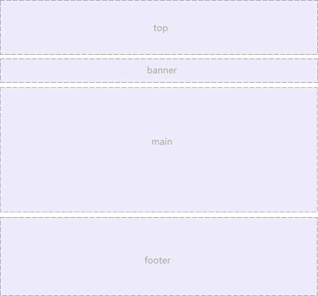

# CSS

## CSS字体样式属性

- 字体大小：`font-size: 14px;`

- 字体：`font-family: "Times New Roman", "微软雅黑";`

- CSS Unicode字体：`font-family: "\5FAE\8F6F\96C5\9ED1";`

- 字体粗细：`font-weight: normal(400) | bold(700) | bolder | lighter;`

- 字体风格：`font-style: normal | italic(斜体) | oblique(倾斜);`-->一般用来消除`<em>`和`<i>`的倾斜

- 综合设置字体样式：`font: font-style font-weight font-size/line-height font-family;`-->font-size和font-family必须保留

## 选择器

### 标签选择器(元素选择器)

- `div {}`

### 类选择器(类名可重复)

- `.类名 {}`

#### 多类名选择器

- 给标签指定多个类名

### id选择器(id唯一)

- `#id名 {}`

### 通配符选择器

- `* {}`

### 伪类选择器

#### 链接伪类选择器

- `:link`：未访问的链接

- `:visited`：已访问的链接

- `:hover`：鼠标移动到链接上

- `:active`：选定的链接

#### 结构伪类选择器(CSS3)

- `:first-child`

- `:last-child`

- `:nth-child(n)`

- `:nth-last-child(n)`

#### 目标伪类选择器(CSS3)

- `:target {}`：对url才有效，可用于锚点定位

## CSS外观属性

- `color`：文本颜色，用rgb(100%, 0%, 0%)时0%不能写为0
- `line-height`：行间距：一般比字号大7~8px
- `text-align`：水平对齐方式left(默认)，right，center
- `text-indent`：首行缩进，1em就是一个汉字的宽度
- `letter-spacing`：字间距，可负，默认normal
- `word-spacing`：单词间距，可负，默认normal，中文无效
- `color: rgba(r,g,b,a)`:颜色半透明(CSS3)，a在0~1间
- `text-shadow: 水平位置(h-shadow) 垂直位置(v-shadow) 模糊距离(blur) 阴影颜色(color);`：text-shadow: 3px 4px 5px rgba(0, 0, 0, .5);

## 引入CSS样式表

### 内部样式表

``` html
<head>
<style type="text/CSS">
    选择器 {
        属性1: 属性值1;
        属性2: 属性值2;
        属性3: 属性值3;
    }
</style>
</head>
```

### 行内式(内联样式)

``` html
<标签名 style="属性1:属性值1; 属性2:属性值2; 属性3:属性值3;"> 内容 </标签名>
```

### 外部样式表(外链式)

```html
<head>
  <link href="CSS文件的路径" type="text/CSS" rel="stylesheet" />
</head>
```

## 标签显示模式(display)

### 块级元素(block-level)

- 每个块级元素会占据一整行或多行，可设置宽高，对齐等属性，常用于网页布局和网页结构的搭建
- 如：`<h1>~<h6>、<p>、<div>、<ul>、<ol>、<li>等`
- 特点：
  - 总是从新行开始
  - 高度、行高、外边距、内边距都可控制
  - 宽度默认是容器的100%
  - 可以容纳内联元素和其它块元素
  
### 行内元素(inline-level)

- 不占有独立区域，靠自身字体大小和图像尺寸来支撑结构，一般不可设置宽高、对齐等属性，常用于控制页面文本样式
- 如：`<a>、<strong>、<b>、<em>、<i>、<del>、<s>、<ins>、<u>、<span>`
- 特点：
  - 和相邻行内元素在一行上
  - 高、宽无效，但水平方向的padding和margin可设置
  - 默认宽度是它自身内容的宽度
  - 行内元素只能容纳文本或其它行内元素(`<a>`特殊)

### 行内块元素(inline-block)

- 如：`、<input />、<td>`
- 特点：
  - 和相邻行内元素(行内块)在一行上，但是之间会有空白间隙
  - 默认宽度就是它本身内容的宽度
  - 高度、行高、外边距、内边距都可以控制

### 标签模式转换display

- 块转行内：display: inline;
- 行内转块：display: block;
- 块、行内元素转换为行内块：display: inline-block;

## CSS复合选择器

### 交集选择器(使用较少)

- `div.class {}`：标签.class

### 并集选择器(通常用于集体申明)

- 用`,`隔开

### 后代选择器

- 用`&nbsp;`隔开

### 子元素选择器

- 用`>`隔开

### 属性选择器

选取标签带有某些特殊属性的选择器 我们成为属性选择器

用**[]**表示
``` css
	a[title] {} /*titile属性*/
	input[type=text] {} /*等于text的type属性*/
	div[class^=font] /*表示以font开始的*/
	div[class$=footer] /*表示以footer结尾的*/
	div[class*=tao] /*表示含有tao*/
```

### 伪元素选择器(CSS3)

- `E::first-letter`：文本第一个单词或字
- `E::first-line`：文本第一行
- `E::selection`：可改变选中文本的样式
- `E::before:div::before { content: "开始";}`
- `E::after:div::before { content: "结束";}`

## CSS背景(background)

### 背景颜色(color)

### 背景图片(image)

- `background-image: none(默认) | url;`

### 背景平铺(repeat)

- `background-repeat: repeat(默认) | no-repeat | repeat-x | repeat-y;`

### 背景位置(position)

- `background-position: length length;`
- `background-position: position position`
- 参数：
  - length：百分数 | 由浮点数和单位标识符组成的长度值
  - position: top | center | bottom | left | center | right
- 说明：
  如果指指定一个值，该值将用于横坐标。纵坐标默认50%
  如果精确单位和方位名词混合，则x在前y在后
  实际工作中居中对齐用的最多

### 背景附着

- `background-attachment: scroll | fixed;`

### 背景简写

- `background: transparent(背景透明) url(image.jpg) repeat-y scroll 50% 0;`

### 背景透明(CSS3)

- `background: rgba(0, 0, 0, 0.3);`
- 背景半透明指盒子半透明

### 背景缩放(CSS3)

- `background-size:`
  - 长度单位px或百分比(百分比参照盒子宽高)
  - **cover**：自动调整缩放比例，图片填满背景区，溢出部分隐藏
  - contain：自动调整缩放比例，保证图片完整显示在背景区

### 多背景(CSS3)

- 每组属性用`,`分隔
- 若多重背景之间存在交集(重叠)，前面背景图会覆盖后面的背景图
- 为避免背景色盖住图像，通常定义在最后一组上

### 凹凸文字

```html
<head>
	<style>
		body {
			background-color: #ccc;

		}

		div {
			color: #ccc;
			font: 700 80px "微软雅黑";
		}

		div p:first-child {
			text-shadow: 1px 1px 1px #000000, -1px -1px 1px #ffffff;
		}
		div p:last-child {
			/* text-shadow: 水平位置  垂直位置  模糊距离 阴影颜色; */
			text-shadow: -1px -1px 1px #000, 1px 1px 1px #fff;
		}
	</style>
</head>

<body>
	<div>
		<p>我是凸起的文字</p>
		<p>我是下凹的文字</p>
	</div>

</body>
```

### 导航栏案例

#### 文本的装饰

- `text-decoration:none | underline | overline | line-through;`
- 文字垂直居中：设定行高等于盒子高度

## CSS三大特性

### 层叠性

- 样式冲突，就近原则

### CSS继承性

- 恰当使用继承可以简化代码，降低CSS样式的复杂性
- 子元素可继承父元素的样式：text-,font-,line-,color

### CSS优先级

- 继承样式的权重为0
- 行内样式优先
- 权重相同时，CSS遵循就近原则
- `!important`具有最大优先级

#### CSS特殊性(Specificity)

| 继承或者* 的贡献值       | 0,0,0,0  |
| ------------------------ | -------- |
| 每个元素（标签）贡献值为 | 0,0,0,1  |
| 每个类，伪类贡献值为     | 0,0,1,0  |
| 每个ID贡献值为           | 0,1,0,0  |
| 每个行内样式贡献值       | 1,0,0,0  |
| 每个!important贡献值     | ∞ 无穷大 |

权重可以叠加:
```
div ul  li   ------>      0,0,0,3

.nav ul li   ------>      0,0,1,2

a:hover      -----—>      0,0,1,1

.nav a       ------>      0,0,1,1   

#nav p       ----->       0,1,0,1
```

优先级总结：
1. 使用了 !important声明的规则。
2. 内嵌在 HTML 元素的 style属性里面的声明。
3. 使用了 ID 选择器的规则。
4. 使用了类选择器、属性选择器、伪元素和伪类选择器的规则。
5. 使用了元素选择器的规则。
6. 只包含一个通用选择器的规则。
7. 同一类选择器则遵循就近原则。

~~~
总结：权重是优先级的算法，层叠是优先级的表现
~~~

## 盒子模型

### 盒子边框(border)

- `border : border-width || border-style || border-color `
- 边框样式(border-style)：
  - none：无边框（默认值）
  - solid：单实线（最常用）
  - dashed：虚线
  - dotted：点线
  - double：双实线

#### 盒子边框写法表

|              |                                                                                                            |                                                                   |
| ------------ | ---------------------------------------------------------------------------------------------------------- | ----------------------------------------------------------------- |
| 设置内容     | 样式属性                                                                                                   | 常用属性值                                                        |
| 上边框       | border-top-style:样式; border-top-width:宽度;border-top-color:颜色;border-top:宽度 样式 颜色;              |                                                                   |
| 下边框       | border-bottom-style:样式;border- bottom-width:宽度;border- bottom-color:颜色;border-bottom:宽度 样式 颜色; |                                                                   |
| 左边框       | border-left-style:样式; border-left-width:宽度;border-left-color:颜色;border-left:宽度 样式 颜色;          |                                                                   |
| 右边框       | border-right-style:样式;border-right-width:宽度;border-right-color:颜色;border-right:宽度 样式 颜色;       |                                                                   |
| 样式综合设置 | border-style:上边 [右边 下边 左边];                                                                        | none无（默认）、solid单实线、dashed虚线、dotted点线、double双实线 |
| 宽度综合设置 | border-width:上边 [右边 下边 左边];                                                                        | 像素值                                                            |
| 颜色综合设置 | border-color:上边 [右边 下边 左边];                                                                        | 颜色值、#十六进制、rgb(r,g,b)、rgb(r%,g%,b%)                      |
| 边框综合设置 | border:四边宽度 四边样式 四边颜色;                                                                         |                                                                   |

#### 表格的细线边框

```css
table {
  border-collapse: collapse; /*collapse表示合并，边框合在一起*/
}
```

#### 圆角边框(CSS3)

- `border-radius: 左上角  右上角  右下角  左下角;`

### 内边距(padding)

- 边框与内容之间的距离

| 值的个数 | 表达意思                                                                                                               |
| -------- | ---------------------------------------------------------------------------------------------------------------------- |
| 1个值    | padding：上下左右边距 比如padding: 3px; 表示上下左右都是3像素                                                          |
| 2个值    | padding: 上下边距 左右边距 比如 padding: 3px 5px; 表示 上下3像素 左右 5像素                                            |
| 3个值    | padding：上边距 左右边距 下边距 比如 padding: 3px 5px 10px; 表示 上是3像素 左右是5像素 下是10像素                      |
| 4个值    | padding:上内边距 右内边距 下内边距 左内边距 比如: padding: 3px 5px 10px 15px; 表示 上3px 右是5px 下 10px 左15px 顺时针 |

### 外边距(margin)

- 外边距会在元素之间创建“空白”
- 取值同padding

#### 外边距实现盒子居中

- 条件：
  - 必须是块级元素
  - 盒子必须指定宽度(width)
- `margin: 0 auto;`

#### 文字和盒子居中以及图片和背景的区别

1. 文字水平居中：`text-align: center;`
2. 盒子水平居中: `margin: 0 auto;`
3. 插入图片：用的最多，如产品展示的图片
4. 背景图片：一般用于图标背景或者超大背景图片

#### 清除元素的默认内外边距

```css
* {
  padding: 0;
  margin: 0;
}
```
注：行内元素只有左右外边距

### 外边距合并

- 使用margin定义块元素的垂直外边距时，可能出现外边距合并

#### 相邻块元素垂直外边距的合并

当上下相邻的两个块元素相遇时，如果上面的元素有下外边距margin-bottom，下面的元素有上外边距margin-top，则他们之间的垂直间距不是margin-bottom与margin-top之和，而是两者中的较大者。这种现象被称为相邻块元素垂直外边距的合并（也称外边距塌陷）。
解决方案：  避免就好了。

#### 嵌套元素垂直外边距的合并

对于两个嵌套关系的块元素，如果父元素没有上内边距及边框，则父元素的上外边距会与子元素的上外边距发生合并，合并后的外边距为两者中的较大者，即使父元素的上外边距为0，也会发生合并。

解决方案：

1. 可以为父元素定义1像素的上边框或上内边距。
2. 可以为父元素添加overflow:hidden。

### content宽度和高度

使用宽度属性width和高度属性height可以对盒子的大小进行控制。

width和height的属性值可以为不同单位的数值或相对于父元素的百分比%，实际工作中最常用的是像素值。

大多数浏览器，如Firefox、IE6及以上版本都采用了W3C规范，符合CSS规范的盒子模型的总宽度和总高度的计算原则是：

```
  /*外盒尺寸计算（元素空间尺寸）*/
  Element空间高度 = content height + padding + border + margin
  Element 空间宽度 = content width + padding + border + margin
  /*内盒尺寸计算（元素实际大小）*/
  Element Height = content height + padding + border （Height为内容高度）
  Element Width = content width + padding + border （Width为内容宽度）
```

注意：

1、宽度属性width和高度属性height仅适用于块级元素，对行内元素无效（ img 标签和 input除外）。

2、计算盒子模型的总高度时，还应考虑上下两个盒子垂直外边距合并的情况。

3、**如果一个盒子没有给定宽度/高度或者继承父亲的宽度/高度，则padding 不会影响本盒子大小**。

### 盒子模型布局稳定性

按照 优先使用  宽度 （width）  其次 使用内边距（padding）    再次  外边距（margin）。   

```
  width >  padding  >   margin   
```

原因：

1. margin 会有外边距合并 还有 ie6下面margin 加倍的bug（讨厌）所以最后使用。

2. padding  会影响盒子大小， 需要进行加减计算（麻烦） 其次使用。

3. width   没有问题（嗨皮）我们经常使用宽度剩余法 高度剩余法来做。

### CSS3盒模型

CSS3中可以通过box-sizing 来指定盒模型，即可指定为content-box、border-box，这样我们计算盒子大小的方式就发生了改变。

可以分成两种情况：

1. box-sizing: content-box  盒子大小为 width + padding + border   content-box:此值为其默认值，其让元素维持W3C的标准Box Mode

2. box-sizing: border-box  盒子大小为 width    就是说  padding 和 border 是包含到width里面的

注：上面的标注的width指的是CSS属性里设置的width: length，content的值是会自动调整的。

### 盒子阴影

`box-shadow: h-shadow(水平阴影，必需) v-shadow(垂直阴影，必需) blur(模糊距离) spread(阴影尺寸) color inset(内部阴影);`

## 浮动(float)

### 普通流(normal flow)

- CSS定位机制：普通流(标准流)、浮动和定位

### 浮动(float)

- 元素的浮动是指设置了浮动属性的元素会脱离标准普通流的控制，移动到其父元素中指定位置的过程。
- `float: left | right | none;`

#### 浮动详细内幕特性

- 浮动首先创建包含块的概念（包裹）。就是说， 浮动的元素总是找理它最近的父级元素对齐。但是不会超出内边距(padding)的范围。
- 浮动的元素排列位置，跟上一个元素（块级）有关系。如果上一个元素有浮动，则A元素顶部会和上一个元素的顶部对齐；如果上一个元素是标准流，则A元素的顶部会和上一个元素的底部对齐。
- 一个父盒子里面的子盒子，如果其中一个子级有浮动的，则其他子级都需要浮动。这样才能一行对齐显示。
- 浮动脱离标准流，不占位置，会影响标准流。浮动只有左右浮动。
- 元素添加浮动后，元素会具有行内块元素的特性。元素的大小完全取决于定义的大小或者默认的内容多少
- 浮动根据元素书写的位置来显示相应的浮动。

- 总结：  浮动 --->  浮漏特       
  - 浮：    加了浮动的元素盒子是浮起来的，漂浮在其他的标准流盒子上面。
  - 漏：    加了浮动的盒子，不占位置的，它浮起来了，它原来的位置漏 给了标准流的盒子。
  - 特：    特别注意，这是特殊的使用，有很多的不好处，使用要谨慎。

### 清除浮动

- 清除浮动主要是为了解决父级元素因为子级浮动引起内部高度为0的问题
- `cleaf: left | right | both;`

#### 额外标签法

- 是W3C推荐的做法是通过在浮动元素末尾添加一个空的标签例如 `<div style=”clear:both”></div>`，或则其他标签br等亦可。
- 优点： 通俗易懂，书写方便
- 缺点： 添加许多无意义的标签，结构化较差。  我只能说，w3c你推荐的方法我不接受，你不值得拥有。。。

#### 父级添加overflow属性方法

- 可以通过触发BFC的方式，可以实现清除浮动效果。）

- 可以给父级添加：`overflow: hidden|auto|scroll;`  都可以实现。

- 优点：  代码简洁

- 缺点：  内容增多时候容易造成不会自动换行导致内容被隐藏掉，无法显示需要溢出的元素。

#### 使用after伪元素清除浮动

```css
 .clearfix:after {  
   content: "."; 
   display: block; 
   height: 0; 
   clear: both; 
   visibility: hidden;  
}   
 .clearfix {
   *zoom: 1;
}   /* IE6、7 专有 */
```
- 优点： 符合闭合浮动思想  结构语义化正确

- 缺点： 由于IE6-7不支持:after，使用 zoom:1触发 hasLayout。

- 代表网站： 百度、淘宝网、网易等

#### 使用before和after双伪元素清除浮动

```css
.clearfix:before,.clearfix:after {
  content: ".";
  display: table;
}
.clearfix:after {
  clear: both;
}
.cleaerfix {
  *zoom: 1;
}
```
- 优点：  代码更简洁

- 缺点：  由于IE6-7不支持:after，使用 zoom:1触发 hasLayout。

- 代表网站： 小米、腾讯等

## 版心和布局流程

- “版心”是指网页中主体内容所在的区域。一般在浏览器窗口中水平居中显示，常见的宽度值为960px、980px、1000px、1200px等。

### 布局流程

为了提高网页制作的效率，布局时通常需要遵守一定的布局流程，具体如下：

1. 确定页面的版心（可视区）。

2. 分析页面中的行模块，以及每个行模块中的列模块。

3. 制作HTML页面，CSS文件。

4. CSS初始化，然后开始运用盒子模型的原理，通过DIV+CSS布局来控制网页的各个模块。

### 一列固定宽度且居中(最普通，常用的结构)



### 两列左窄右宽型


如小米官网

### 通栏平均分布型


如锤子官网

## 定位(position)

### 边偏移

| 边偏移属性 | 描述                                           |
| ---------- | ---------------------------------------------- |
| top        | 顶端偏移量，定义元素相对于其父元素上边线的距离 |
| bottom     | 底部偏移量，定义元素相对于其父元素下边线的距离 |
| left       | 左侧偏移量，定义元素相对于其父元素左边线的距离 |
| right      | 右侧偏移量，定义元素相对于其父元素右边线的距离 |

也就说，以后定位要和这边偏移搭配使用了， 比如 top: 100px;  left: 30px; 等等

### 定位模式

在CSS中，position属性用于定义元素的定位模式，其基本语法格式如下：

选择器{position:属性值;}

position属性的常用值

| 值       | 描述                                             |
| -------- | ------------------------------------------------ |
| static   | 自动定位（默认定位方式）                         |
| relative | 相对定位，相对于其原文档流的位置进行定位         |
| absolute | 绝对定位，相对于其上一个已经定位的父元素进行定位 |
| fixed    | 固定定位，相对于浏览器窗口进行定位               |

#### 静态定位(static)

- 静态定位是所有元素的默认定位方式，在静态定位状态下，无法通过边偏移属性（top、bottom、left或right）来改变元素的位置。

#### 相对定位(relative)

- 相对定位是将元素相对于它在标准流中的位置进行定位，对元素设置相对定位后，可以通过边偏移属性改变元素的位置，但是它在文档流中的位置仍然保留。
- 注意：    相对定位最重要的一点是，它可以通过边偏移移动位置，但是原来的所占的位置，继续占有。

#### 绝对定位(absolute)

- 如果文档可滚动，绝对定位元素会随着它滚动，因为元素最终会相对于正常流的某一部分定位。
- 注意：绝对定位最重要的一点是，它可以通过边偏移移动位置，但是它完全脱标，完全不占位置。

##### 父级没有定位

- 若所有父元素都没有定位，以浏览器为准对齐

##### 父级有定位

- 绝对定位是将元素依据最近的已经定位（绝对、固定或相对定位）的父元素（祖先）进行定位。 

##### 绝对定位的盒子没有边偏移

- 如果只是给盒子指定了 定位，但是没有给与边偏移，则该盒子以标准流来显示排序，和上一个盒子的底边对齐，但是不占有位置。

##### 子绝父相

-  子级是绝对定位的话， 父级要用相对定位。

#### 固定定位(fixed)

- 固定定位是绝对定位的一种特殊形式，它以浏览器窗口作为参照物来定义网页元素。
- 当对元素设置固定定位后，它将脱离标准文档流的控制，始终依据浏览器窗口来定义自己的显示位置。不管浏览器滚动条如何滚动也不管浏览器窗口的大小如何变化，该元素都会始终显示在浏览器窗口的固定位置。
- 固定定位有两点：
1. 固定定位的元素跟父亲没有任何关系，只认浏览器。
2. 固定定位完全脱标，不占有位置，不随着滚动条滚动。

### 叠放次序(z-index)

当对多个元素同时设置定位时，定位元素之间有可能会发生重叠。
在CSS中，要想调整重叠定位元素的堆叠顺序，可以对定位元素应用z-index层叠等级属性，其取值可为正整数、负整数和0。

比如：  z-index: 2;

注意：

1. z-index的默认属性值是0，取值越大，定位元素在层叠元素中越居上。

2. 如果取值相同，则根据书写顺序，后来居上。

3. 后面数字一定不能加单位。

4. 只有相对定位，绝对定位，固定定位有此属性，其余标准流，浮动，静态定位都无此属性，亦不可指定此属性。

### 定位模式转换

- 跟 浮动一样， 元素添加了 绝对定位和固定定位之后， 元素模式也会发生转换， 都转换为 行内块模式， 因此 比如 行内元素 如果添加了 绝对定位或者 固定定位后，可以不用转换模式，直接给高度和宽度就可以了。

## 元素的显示与隐藏

在CSS中有三个显示和隐藏的单词比较常见，我们要区分开，他们分别是 display visibility 和 overflow。

他们的主要目的是让一个元素在页面中消失，但是不在文档源码中删除。 最常见的是网站广告，当我们点击类似关闭不见了，但是我们重新刷新页面，它们又会出现和你玩躲猫猫！！

### display显示

display 设置或检索对象是否及如何显示。

display : none 隐藏对象 与它相反的是 display:block 除了转换为块级元素之外，同时还有显示元素的意思。

特点： 隐藏之后，不再保留位置。

### visibility可见性

设置或检索是否显示对象。

visible : 　对象可视

hidden : 　对象隐藏

特点： 隐藏之后，继续保留原有位置。（停职留薪）

### overflow溢出

检索或设置当对象的内容超过其指定高度及宽度时如何管理内容。

visible : 　不剪切内容也不添加滚动条。

auto : 　 超出自动显示滚动条，不超出不显示滚动条

hidden : 　不显示超过对象尺寸的内容，超出的部分隐藏掉

scroll : 　不管超出内容否，总是显示滚动条

## CSS高级技巧

### CSS用户界面样式

 所谓的界面样式， 就是更改一些用户操作样式， 比如 更改用户的鼠标样式， 表单轮廓等。但是比如滚动条的样式改动受到了很多浏览器的抵制，因此我们就放弃了。 防止表单域拖拽

#### 鼠标样式cursor

 设置或检索在对象上移动的鼠标指针采用何种系统预定义的光标形状。 

```html
cursor :  default  小白 | pointer  小手  | move  移动  |  text  文本
```

 鼠标放我身上查看效果哦：

```html
<ul>
  <li style="cursor:default">我是小白</li>
  <li style="cursor:pointer">我是小手</li>
  <li style="cursor:move">我是移动</li>
  <li style="cursor:text">我是文本</li>
</ul>
```

 尽量不要用hand  因为 火狐不支持     pointer ie6以上都支持的尽量用

 #### 轮廓 outline

 是绘制于元素周围的一条线，位于边框边缘的外围，可起到突出元素的作用。

~~~css
 outline : outline-color ||outline-style || outline-width 
~~~

 但是我们都不关心可以设置多少，我们平时都是去掉的。

最直接的写法是 ：  outline: 0; 

```html
 <input  type="text"  style="outline: 0;"/>
```

#### 防止拖拽文本域resize

resize：none    这个单词可以防止 火狐 谷歌等浏览器随意的拖动 文本域。

右下角可以拖拽： 

`<textarea></textarea>`
右下角不可以拖拽： 

```html
<textarea  style="resize: none;"></textarea>
```

### vertical-align 垂直对齐

- `vertical-align : baseline |top |middle |bottom`

设置或检索对象内容的垂直对其方式。 


vertical-align 不影响块级元素中的内容对齐，它只针对于 行内元素或者行内块元素，特别是行内块元素， 通常用来控制图片和表单等。

#### 图片、表单和文字对齐

vertical-align: baseline（默认） | top | middle | bottom
vertical-align不影响块级元素中的内容对齐，只针对行内元素或者行内块元素，**通常用来控制图片和表单与文字的对齐**

图片文字居中对齐:
```css
img {
	vertical-align: middle;
}```
表单与文字居中对齐：
​```css
textarea {
	vertical-align: middle;
}
```

#### 去除图片底侧空白缝隙

- 有个很重要特性你要记住： 如果一个元素没有基线，比如图片或者表单等行内块元素，则他的底线会和父级盒子的基线对齐。这样会造成一个问题，就是图片底侧会有一个空白缝隙。

解决的方法就是：  

**1. 给img添加vertical-align:middle | top等等。  让图片不要和基线对齐。**
2. 给img 添加 display：block; 转换为块级元素就不会存在问题了。

### 溢出的文字隐藏

#### word-break:自动换行

- normal   使用浏览器默认的换行规则。

- break-all   允许在单词内换行。

- keep-all    只能在半角空格或连字符处换行。

#### white-space

通常用于强制一行显示内容
normal：默认
nowrap：强制在同一行显示所有文本，直到文本结束或者遭遇br标签对象才换行 （如新闻标题）

#### text-overflow文字溢出

设置或检索是否使用一个省略标记（...）表示对象内文本的溢出
clip：不显示(...)而是简单的裁切
ellipsis：当对象内文本溢出时显示省略标记(...)
注：一定要首先强制一行内显示，再和overflow属性搭配使用
```css
white-space: nowrap;
overflow: hidden;
text-overflow: ellipsis;
```

### CSS精灵技术(sprite)(小妖精/雪碧)

#### 产生背景

有效减少服务器接受和发送请求的次数，提高页面的加载速度

#### 精灵技术本质

用于处理网页背景图像的方式。将一个页面涉及到的所有背景图集中到一张大图中，然后将大图应用于网页，这样只需向服务器
发送一次请求就可全部展示网页中的背景图。一般称这个大图为<u>精灵图</u>

#### 精灵图的使用

主要是盒子的width和height，以及所需图片在精灵图中的position（一般都是负值）

#### 制作精灵图

一般由网页美工做

- 精灵图上放的都是小的装饰性质的背景图片。不能放插入图片
- 精灵图的宽度取决于最宽的背景
- 可以横向摆放，也可以纵向摆放，但每个图片之间间隔至少隔开偶数像素
- 在最低端留一片空隙，方便以后添加其它精灵图
  背景图片较多时，建议使用精灵技术

PS:

- 新建文件
- 名称：sprite
- 设置合适的宽高（最宽背景图的宽）
- 背景内容：透明
- 找到psd文件中的背景图所包含的图层-复制到sprite-合并图层
- 保存1：文件-存储为psd格式
- 保存2：文件-存储为web所用格式-PNG-24/PNG-8-选中透明度

#### 字体图标

##### 字体图片使用流程

1. UI人员设计字体图标效果图(svg)
   用illustrator或Sketch等矢量图形软件创建icon图标，保存为svg格式

2. 前端人员上传生成兼容性字体文件包
   推荐网站：http://icomoon.io/http://www.iconfont.cn

3. 前端人员下载兼容字体文件包到本地
   fonts文件夹

4. 把字体文件包引入到HTML页面中
   将fonts文件夹复制到项目文件夹中

```css
<style>
第一步：在样式中声明字体
	@font-face { /*声明电脑中没有的字体*/
		font-family: 'icomoon';
		src: url('fonts/icomoon.');
		src: url('fonts.icomoon.') format('后缀格式'),
		src: url('fonts.icomoon.') format('后缀格式'),
		src: url('fonts.icomoon.') format('后缀格式');
		font-weight: normal;
		font-style: normal;
	}
第二步：给盒子使用字体
	/*引用字体*/
	span {
		font-family: "icomoon"; /*保证和上面的font-family名字相同*/
	}
第三步：盒子里面添加结构(字体包中的index.html文件中)
	span::before {
		content: "\e900";
	}
	或者复制小方块
	<span>小方块</span>
</style>
```

##### 追加新图标到原来库里面

把压缩包里面的selection.json从新上传，然后选中自己想要的新图标，从新下载压缩包替换原来的文件

### 滑动门

利用CSS精灵（主要是背景位置）和盒子padding撑开宽度，以适应不同字数的导航栏
一般布局如下

```html
<li>
  <a href="#">
    <span>导航栏内容</span>
  </a>
</li>
```

总结： 

1. a 设置 背景左侧，padding撑开合适宽度。    
2. span 设置背景右侧， padding撑开合适宽度 剩下由文字继续撑开宽度。
3. 之所以a包含span就是因为 整个导航都是可以点击的。

案例：
```html
<style>
	* {
		margin: 0;
		padding: 0;
	}
	a {
		display: inline-block;
		height: ..px;
		/*不能给宽度,用padding挤开*/
		background: url(images/xx.png) no-repeat;
		padding-left: ..px; /*撑开盒子*/
		text-decoration: none;
		line-height: ..px;
	}
	a span {
		display: inline-block;
		height: ..px;
		background: url(images/xx.png) no-repeat right;/*背景右对齐right*/
		padding-right: ..px; /*撑开盒子*/
	}
</style>
<body>
	<a href="#">
		<span>首页</span>
	</a>
</body>
```

### before和after伪元素（详解）

.one：类选择器
:hover：伪类选择器
::after：伪元素选择器

伪元素选择器：本质上是插入一个元素（标签、盒子），只不过是行内元素（不能设置宽高）

#### 鼠标经过显示边框

```html
	div {
		width: 296px;
		height: 180px;
		margin: 20px auto;
		position: relative;
	}
	div:hover::before {
		content: "";
		width: 100%;
		height: 100%;
		border: 10px solid rgba(255, 5, 5, 0.4);
		display: block;
		position: absolute;
		top: 0;
		left: 0;
		box-sizing: border-box;
	}
```

### 伸缩布局(CSS3)

- 父级添加：display: flex;

属性：
1. flex子项目在主轴缩放比例，不指定flex则不参与伸缩分配。flex: 1;
   通过给某个盒子固定宽度：width: 100px; 则剩下的盒子在减去100px的宽度中分
   min-width: 280px; 最小宽度不能小于280px;
   max-width: 1200px; 最大宽度不能大于1200px;

2. flex-direction: row | column; 设置主轴方向水平|垂直 (父级添加)

3. justify-content调整主轴对齐(水平对齐)

|值				|描述											|												|
|--				|--												|--												|
|flex-start		|默认值。项目位于容器开头。						|让子元素从父容器开头排列						|
|flex-end		|项目位于容器结尾								|让子元素从父容器后面排列						|
|center			|项目位于容器中心								|让子元素从父容器中间显示						|
|space-between	|项目位于各行之间留有空白的容器内				|左右的盒子贴近父盒子，中间的平均分布空白间距	|
|space-around	|项目位于各行之前、之间、之后都留有空白的容器内	|相当于给每个盒子添加了左右margin外边距			|

4. align-items调整侧轴对齐(垂直对齐) *单行用的较多*

|值			|描述							|白话文												|
|--			|--								|--													|
|stretch	|默认值，项目被拉伸以适应容器	|让子元素的高度拉伸适用父容器（若子元素不给高度）	|
|center		|项目位于容器中心				|垂直居中											|
|flex-start	|项目位于容器的开头				|垂直对齐开始位置									|
|flex-end	|项目位于容器的结尾				|垂直对齐结束位置									|

5. flex-wrap控制是否换行
   当我们盒子内容的宽度多于父盒子的时候如何处理

|值				|描述																|
|--				|--																	|
|nowarp			|默认值，规定灵活的项目不拆行或不拆列。不换行，则收缩（压缩）显示	|
|wrap			|规定灵活的项目在必要的时候拆行或拆列								|
|wrap-reverse	|规定灵活的项目在必要的时候拆行或拆列，但以相反的顺序				|

6. align-content堆栈（由flex-wrap产生的独立行）对齐
   align-content是针对felx容器里面多轴（多行）的情况，align-items是针对一行的情况进行排列
   必须对父元素设置自由盒属性display: flex;并且设置排列方式为横向排列flex-direction: row;并设置换行，flex-wrap: wrap;
   如：

```css
	display: flex;
	flex-flow: row wrap; /*flex-direction和flex-wrap简写*/
```

这样align-content属性才会起作用

|值				|描述											|
|--				|--												|
|stretch		|默认值，项目被拉伸以适应容器					|
|center			|项目位于容器中心								|
|flex-start		|项目位于容器的开头								|
|flex-end		|项目位于容器的结尾								|
|space-between	|项目位于各行之间留有空白的容器内				|
|space-around	|项目位于各行之前、之间、之后都有空白的容器内	|

7. order控制子项目的排列顺序，正序方式排序，从小到大
   order: -1; 数字越小越靠前，可为负，默认为0；

### 过渡(CSS3)

- transition:要过渡的属性 花费时间 运动曲线 何时开始;
  如果有多组属性变化，用","隔开

|属性						|描述										|CSS|
|--							|--											|--	|
|transition					|简写属性，用于在一个属性中设置四个过渡属性	| 3	|
|transition-property		|规定应用过渡的CSS属性的名称				| 3	|
|transition-duration		|定义过渡效果花费的时间，默认是0s			| 3	|
|transition-timing-function	|规定过渡效果的时间曲线，默认是"ease"		| 3	|
|transition-delay			|规定过渡效果何时开始，默认是0s				| 3	|

属性名称：all（所有属性都变化）
花费时间：s | ms
过渡效果：匀速(linear) | 逐渐慢下来(ease) | 加速(ease-in) | 减速(ease-out) | 先加速后减速(ease-in-out)

例：
```html
<style>
	div {
		width: 200px;
		height: 100px;
		background-color: pink;
		transition: width 0.6s ease 0s, height 0.3s ease-in 1s;
		/*transition写在div中而不是hover里，若写到hover里当鼠标移开时会一下恢复原样，没有过渡效果*/
	}
	div:hover {
		width: 600px;
		height: 300px;
	}
</style>
```
### 2D变形(CSS3) transform

可实现元素的位移、旋转、变形、缩放，甚至支持矩阵方式，配合过渡和即将学习的动画知识，可取代大量之前只能靠Flash才能实现的效果。
变形转换transform

- 移动translate(x,y)
  移动translate(x,y)：水平方向和垂直方向同时移动
  translateX(x)：仅水平方向移动
  translateY(y)：仅垂直方向移动
  transform: translate(50%); %表示走自己宽度的一半
  transform: translate(-50%, -50%);

**定位的盒子居中对齐的完美写法：**

``` css
div {
	position: absolute;
	left: 50%;
	top: 50%;
	/*margin-left: -100px;*/
	transform: translate(-50%, -50%);
}
```

- 缩放scale(x,y)
  scale(x,y)
  scaleX(x)
  scaleY(y)

transform: scale(0.8,1); /*缩小：0.01~0.99，放大：1.01~*/

- 旋转roate(deg)
  transform: rotate(45deg);
  transform-origin可以调整元素转换的原点,4个角可用left top等，精确位置用px像素
  deg是单位，正值顺时针，负值逆时针

注：
元素旋转后，坐标轴也跟着发生转变
调整顺序后可以解决，把旋转放到最后
注意单位是deg度数

- 倾斜skew(deg, deg)
  transform: skew(30deg, 0deg); /*水平倾斜30度，第二个参数不写默认为0*/

transform-origin可以调整元素转换的原点

```
div {
	 transform-origin: left top;
	 transform: rotate(45deg); 
}  /* 改变元素原点到左上角，然后进行顺时旋转45度 */    
```

### 3D变形(CSS3) transform

#### 旋转 rotate

rotateX()：沿着x立体旋转

```css
	img {
		transition: all 0.5s ease 0s;
	}
	img:hover {
		transform: rotateX(180deg);
	}
	
```

rotateY()：沿着y立体旋转
rotateZ()：沿着Z立体旋转
backface-visibility: hidden; 不是正面就隐藏

#### 透视 perspective

透视原理：近大远小
浏览器透视：把近大远小的所有图像，透视在屏幕上
perspective：视距，表示视点距离屏幕的长短。视点，用于模拟透视效果时人眼的位置

perspective一般作为一个属性，设置给父元素，作用于所有3D转换的子元素

**开门案例**
```css
body {
}
.door {
  width: 300px;
  height: 300px;
  margin: 100px auto;
  border: 1px solid gray;
  perspective: 1000px;
  background: url('images/dog.gif') no-repeat center/cover;
  position: relative;
}
.door > div {
  box-sizing: border-box;
  border: 1px solid black;
}
.left {
  float: left;
  width: 50%;
  height: 100%;
  background-color: brown;
  transform-origin: left center;
  transition: 1s;
  position: relative;
}
.left::before {
  content: '';
  position: absolute;
  width: 20px;
  height: 20px;
  border-radius: 50%;
  top: 50%;
  right: 0px;
  transform: translateY(-10px);
  border: 1px solid whitesmoke;
}
.right {
  width: 50%;
  height: 100%;
  float: left;
  background-color: brown;
  transform-origin: right center;
  transition: 1s;
  position: relative;
}
.right::before {
  content: '';
  position: absolute;
  width: 20px;
  height: 20px;
  border-radius: 50%;
  top: 50%;
  left: 0px;
  transform: translateY(-10px);
  border: 1px solid whitesmoke;
}
.door:hover .left {
  transform: rotateY(-130deg);
}
.door:hover .right {
  transform: rotateY(130deg);
}
```

#### 移动 translate

translateX(100px);
translateY(100px);
translateZ(100px); 物体到屏幕的距离

transform: translate3d(x, y, z);x和y可以是px或%，z只能是px

#### 3D呈现(trnasform-style)

设置内嵌的元素在 3D 空间如何呈现，这些子元素必须为转换元素。

flat：所有子元素在 2D 平面呈现

preserve-3d：保留3D空间

3D元素构建是指某个图形是由多个元素构成的，可以给这些元素的父元素设置transform-style: preserve-3d来使其变成一个真正的3D图形。

一般而言，该声明应用在3D变换的兄弟元素们的父元素上。

**翻转盒子案例(百度钱包)**

~~~css
body {
  margin: 0;
  padding: 0;
  background-color: #B3C04C;

}

.wallet {
  width: 300px;
  height: 300px;
  margin: 50px auto;
  position: relative;
  transform-style: preserve-3d;
  transition: all 0.5s;
}

.wallet::before, .wallet::after {
  content: '';
  position: absolute;
  left: 0;
  top: 0;
  display: block;
  width: 100%;
  height: 100%;
  background-image: url(./images/bg.png);
  background-repeat: no-repeat;
}

.wallet::before {
  background-position: right top;
  transform: rotateY(180deg);
}

.wallet::after {
  background-position: left top;
  transform: translateZ(2px);
}

.wallet:hover {
  transform: rotateY(180deg);
}
~~~

### 动画(CSS3) animation

animation: 动画名称 动画时间 运动曲线 何时开始 播放次数 是否反向;

|属性						|描述											|CSS|
|--							|--												|--	|
|@keyframes					|规定动画										|3	|
|animation					|除了animation-play-state属性外的属性的简写属性	|3	|
|animation-name				|规定@keyframes动画的名称						|3	|
|animation-duration			|规定动画完成一个周期所花费的秒或毫秒。默认是0	|3	|
|animation-timing-function	|规定动画的速度曲线。默认是ease					|3	|
|animation-delay			|规定动画何时开始。默认是0						|3	|
|animation-iteration-count	|规定动画被播放的次数。默认是1					|3	|
|animation-direction		|规定动画是否在下一周期逆向播放。默认是normal	|3	|
|animation-play-state		|规定动画是否正在运行或暂停。默认是running		|3	|
|animation-fill-mode		|规定对象动画时间之外的状态						|3	|

```
@keyframes 动画名称 {
	from {
		transform: translateX(0);
	}
	to {
		transform: translateX(500px);
	}
}
```

animation-iteration-count: infinite;无限循环
animation-direction: normal | reverse | alternate(交替正反) | alternate-reverse(交替反正);
一般情况只用：
	animation: animation-name animation-duration;

**多组动画**

```
@keyframes goback {
	0% {/*起始位置 等价于from*/
		
	}
	50% {
		transform: translateX(1000px);
	}
	51% { /*反转图片*/
		transform: translateX(1000px) rotateY(180deg);
	}
	100% {/*结束为止 相当于to*/
		transform: translateX(0) rotate(180deg);
	}
}
```

**小汽车案例**
```css
body {
  background: white;
}
img {
  width: 200px;
}
.animation {
  animation-name: goback;
  animation-duration: 5s;
  animation-timing-function: ease;
  animation-iteration-count: infinite;
}
@keyframes goback {
  0%{}
  49%{
    transform: translateX(1000px);
  }
  55%{
    transform: translateX(1000px) rotateY(180deg);
  }
  95%{
    transform: translateX(0) rotateY(180deg);
  }
  100%{
    transform: translateX(0) rotateY(0deg);
  }
}
```

## BFC(块级格式化上下文)

BFC是一个独立的渲染区域，只有Block-level Box参与，它规定了内部的Block-level Box如何布局，并且与这个区域外部毫不相干

### 能产生BFC的元素

display: block | list-item(ul>li) | table

给以上元素添加如下属性可触发BFC：

- float不为none
- display为inline-block,table-cell,table-caption,flex,inline-flex
- overflow不为visible

## BFC元素所具有的特性

BFC布局规则特性：

1. 在BFC中，盒子从顶端开始垂直地一个接一个排列
2. 盒子垂直方向的距离由margin决定。属于同一个BFC的两个相邻盒子的margin会发生重叠
3. 在BFC中，每一个盒子的左外边缘(margin-left)会触碰到容器的左边缘(border-left)（对于从右到左的格式来说，则触碰到右边缘）
4. BFC的区域不会与浮动的盒子产生交集，而是紧贴浮动边缘
5. 计算BFC的高度时，自然也会检测浮动的盒子的高度

它是一个独立的渲染区域，只有Block-level Box参与，它规定了内部的Block-level Box如何布局，并且与这个区域外部毫不相干

### BFC的用途

1. 清除元素内部浮动(父元素未设置高度时)
   只要把父元素设为BFC就可以清理子元素的浮动了，最常见的用法是在父元素上设置overflow: hidden;对于IE6加上zoom: 1;
   主要用到：
   **计算BFC的高度时，自然也会检测浮动的盒子高度**

2. 解决外边距合并问题
   主要用到
   **盒子垂直方向的距离由margin决定。属于同一个BFC的两个相邻盒子的margin会发生重叠**
   属于同一个BFC的两个相邻盒子的margin会发生重叠，那么我们创建不属于同一个BFC，就不会发生margin重叠了

3. 制作右侧自适应的盒子问题
   主要用到
   **BFC的区域不会与浮动盒子产生交集，而是紧贴浮动边缘**

## CSS补充知识

### 焦点部分所用知识点

### 背景半透明

### 优雅降级和渐进增强

渐进增强(progressive enhancement)：针对低版本浏览器进行构建页面，保证最低的功能，然后再针对高级浏览器进行效果、交互等改进和追加功能达到更好的用户体验。
优雅降级(graceful degradation)：一开始就构建完整的功能，然后再针对低版本浏览器进行兼容
*区别*：渐进增强是向上兼容，优雅降级是向下兼容

### 浏览器前缀

|浏览器前缀	|浏览器									|
|--			|--										|
|-webkit-	|Google Chrome, Safari, Android Browser	|
|-moz-		|Firefox								|
|-o-		|Opera									|
|-ms-		|Internet Explorer, Edge				|
|-khtml-	|Konqueror								|

### 背景渐变

兼容性问题很严重，必须在前面添加浏览器的私有前缀
线性渐变：

```
background: -webkit-linear-gradient(渐变的起始位置, 起始颜色, 结束颜色);
如:background: -webkit-linear-gradient(top, red, green);
background: -webkit-linear-gradient(渐变的起始位置, 颜色 位置, 颜色 位置...);
如:backgrouond: -webkit--linear-gradient(top, red 0%, green 50%, skyblue 80%, hotpink 100%);
```

### CSS3 W3C统一验证工具

CssStats是一个在线的CSS代码分析工具
http://www.cssstats.com

**[W3C统一验证工具](http://validator.w3.org/unicorn/)**

### CSS压缩

站长之家：http://tool.chinaz.com/Tools/CssFormat.aspx

### 旋转轮播图

需要用到**透视**，**过渡**，**子元素**，**preserve-3d**

**transform-style**
指定嵌套元素如何在3D空间中呈现
flat：默认值，表示所有子元素在2D平面呈现
preserve-3d：表示所有子元素在3D平面呈现
